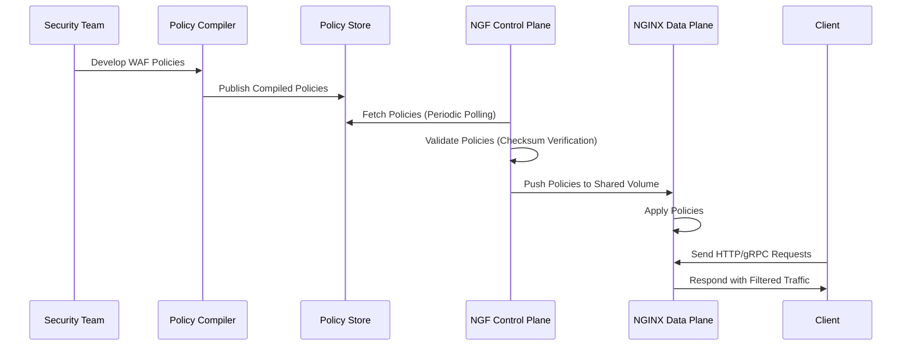

# Enhancement Proposal-3341: NGINX App Protect WAF Integration

- Issue: https://github.com/nginx/nginx-gateway-fabric/issues/3341
- Status: Provisional

## Summary

This proposal describes the integration of NGINX App Protect (NAP) WAF v5 into NGINX Gateway Fabric (NGF) to provide comprehensive WAF protection at Gateway and Route levels while working within NAP v5's architectural constraints of multi-container deployment and pre-compiled policy requirements. The design uses Gateway API inherited policy attachment to provide flexible, hierarchical WAF protection with GitOps-friendly static policy references through automatic polling and change detection.

## Goals

- Extend NginxProxy resource to enable NAP WAF for GatewayClass/Gateway with multi-container orchestration
- Design WAFPolicy custom resource using inherited policy attachment for hierarchical WAF configuration
- Define deployment workflows that accommodate NAP v5's external policy compilation requirements
- Provide secure and automated policy distribution mechanisms from external sources
- Support GitOps workflows with static policy file references and automatic change detection
- Deliver enterprise-grade WAF capabilities through Kubernetes-native APIs with intuitive policy inheritance
- Maintain alignment with NGF's existing security and operational patterns
- Support configurable security logging for WAF events and policy violations
- Support both HTTPRoute and GRPCRoute protection

## Non-Goals

- Compiling or updating NAP WAF policies (handled by external NAP v5 tooling)
- Providing inline policy definition (not supported by NAP v5 architecture)
- Supporting NGINX OSS (NAP v5 does not require NGINX Plus, but OSS support is out of scope at this time)
- Real-time policy editing interfaces
- Policy version management system
- Persistent storage management for policy files

## Introduction

### NAP v5 Architectural Constraints

NGINX App Protect WAF v5 imposes specific architectural requirements that fundamentally shape this integration design:

- **Multi-container deployment**: Requires separate `waf-enforcer` and `waf-config-mgr` containers alongside the main NGINX container
- **Pre-compiled policies**: WAF policies must be compiled externally using NAP tooling before deployment (cannot be defined inline in Kubernetes resources)
- **Shared volume architecture**: Containers communicate through shared filesystem volumes rather than direct API calls

### Design Philosophy

This proposal provides the best possible Kubernetes-native experience while respecting NAP v5 constraints, abstracting complexity from end users where possible while maintaining operational flexibility for enterprise environments. The design uses Gateway API's inherited policy attachment pattern to provide intuitive hierarchical security with the ability to override policies at more specific levels.

### GitOps Integration

A key design principle is seamless GitOps workflow support through automatic change detection:

- **Automatic Polling**: When polling is enabled, NGF periodically checks for policy changes using checksum validation
- **Efficient Updates**: Only downloads policy bundles when content actually changes
- **CI/CD Friendly**: Teams can update policies without modifying Kubernetes resources

**Polling Mechanism:**

- Configurable polling interval (default: 5 minutes)
- Checksum-based change detection for efficiency
- Only downloads policy bundles when content changes
- New policies applied immediately upon detection

### Policy Attachment Strategy

The design uses **inherited policy attachment** following Gateway API best practices:

- **Single target per policy**: A WAFPolicy targets a single resource (either a Gateway or a Route) following [gep-2649 guidelines](https://gateway-api.sigs.k8s.io/geps/gep-2649/#policy-targetref-api).
- **Gateway-level policies** provide default protection for all routes attached to the Gateway
- **Route-level policies** can override Gateway-level policies for specific routes requiring different protection
  - NB: Route-level WafPolicies always override Gateway-level WafPolicies for routes they explicitly target. However, it is not possible to completely disable WAF protection for a specific Route when a Gateway-level WAFPolicy is active. Instead, the Route-level policy configuration entirely replaces the Gateway-level policy for that route.
- **Policy precedence**: More specific policies (Route-level) override less specific policies (Gateway-level)
- **Automatic inheritance**: New routes automatically receive Gateway-level protection without explicit configuration

### Storage Architecture

The integration uses ephemeral volumes (emptyDir) for NAP v5's required shared storage, consistent with NGF's existing ReadOnlyRootFilesystem security pattern. This approach provides:

- **Security alignment**: No persistent state that could be compromised
- **Operational simplicity**: No persistent volume lifecycle management
- **Clean failure recovery**: Fresh volumes on pod restart with current policies
- **Immutable infrastructure**: Policy files cannot be modified at runtime

### Overall System Architecture

```mermaid
graph TB
    %% External Policy Management
    subgraph "External Policy Management"
        SecTeam[Security Team]
        Compiler[NAP v5 Compiler]
        Store[Policy Store<br/>S3/HTTP/MinIO]
    end

    %% Kubernetes Cluster
    subgraph "Kubernetes Cluster"

        %% Control Plane
        subgraph "nginx-gateway namespace"
            NGFPod[NGF Pod<br/>Controllers + Policy Fetcher]
            NGFServiceAccount[NGF Service Account<br/>Native Cloud Auth Annotations]
        end

        %% Application Namespace
        subgraph "applications namespace"

            %% Gateway Resources
            Gateway[Gateway<br/>*.example.com]
            HTTPRoute[HTTPRoute<br/>Protected Route]
            GRPCRoute[GRPCRoute<br/>Protected gRPC Service]
            Application[Application<br/>Backend Service]

            %% Custom Resources (all in app namespace)
            NginxProxy[NginxProxy<br/>waf.enabled=true]
            GatewayWAFPolicy[WAFPolicy<br/>Gateway-level Protection]
            RouteWAFPolicy[WAFPolicy<br/>Route-level Override]
            Secret[Secret<br/>Store Credentials<br/>Optional - Fallback Auth Only]

            %% NGINX Data Plane (WAF Enabled)
            subgraph "NGINX Pod (Multi-Container when WAF enabled)"
                direction TB
                NGINXContainer[NGINX Container<br/>+ NAP Module]
                WafEnforcer[WAF Enforcer<br/>Container]
                WafConfigMgr[WAF Config Manager<br/>Container]

                subgraph "Shared Volumes (Ephemeral)"
                    PolicyVol[Policy Volume<br/>emptyDir]
                    ConfigVol[Config Volume<br/>emptyDir]
                end
            end
        end
    end

    %% External Access
    PublicEndpoint[Public Endpoint<br/>Load Balancer]
    Client[Client Traffic]

    %% Policy Development Flow
    SecTeam -->|Develop & Compile| Compiler
    Compiler -->|Publish Bundle| Store

    %% Policy Attachment Flow
    GatewayWAFPolicy -.->|Targets & Protects| Gateway
    RouteWAFPolicy -.->|Targets & Overrides| HTTPRoute
    Gateway -->|Inherits Protection| HTTPRoute
    Gateway -->|Inherits Protection| GRPCRoute

    %% Configuration Flow
    Store -.->|Policy Location| GatewayWAFPolicy
    Store -.->|Policy Location| RouteWAFPolicy
    NginxProxy -.->|Enables WAF| Gateway

    %% Control Plane Operations
    NGFPod -->|Watches Resources| NginxProxy
    NGFPod -->|Watches Resources| GatewayWAFPolicy
    NGFPod -->|Watches Resources| RouteWAFPolicy
    NGFPod -->|Periodic Polling<br/>Checksum Validation| Store
    NGFPod -->|Fetches Policy<br/>Native Cloud Auth| Store
    NGFServiceAccount -.->|Cloud Provider<br/>Authentication| Store
    NGFPod -.->|Fallback: Uses Credentials| Secret
    NGFPod ===|gRPC Config| NGINXContainer
    NGFPod -->|Deploy Policy| PolicyVol

    %% NAP v5 Inter-Container Communication
    NGINXContainer <-->|Shared FS| PolicyVol
    WafEnforcer <-->|Shared FS| PolicyVol
    WafConfigMgr <-->|Shared FS| PolicyVol
    WafConfigMgr <-->|Shared FS| ConfigVol
    NGINXContainer <-->|Shared FS| ConfigVol

    %% Traffic Flow
    Client ==>|HTTP/HTTPS/gRPC| PublicEndpoint
    PublicEndpoint ==>|WAF Protected| NGINXContainer
    NGINXContainer ==>|Filtered Traffic| Application

    %% Resource Relationships
    HTTPRoute -->|Attached to| Gateway
    GRPCRoute -->|Attached to| Gateway

    %% Styling
    classDef external fill:#e1f5fe,stroke:#01579b,stroke-width:2px
    classDef control fill:#f3e5f5,stroke:#4a148c,stroke-width:2px
    classDef gateway fill:#66CDAA,stroke:#333,stroke-width:2px
    classDef wafRequired fill:#ffebee,stroke:#c62828,stroke-width:3px
    classDef app fill:#fce4ec,stroke:#880e4f,stroke-width:2px
    classDef volume fill:#f1f8e9,stroke:#33691e,stroke-width:2px
    classDef endpoint fill:#FFD700,stroke:#333,stroke-width:2px
    classDef optional fill:#f0f8ff,stroke:#4169e1,stroke-width:2px,stroke-dasharray: 5 5
    classDef cloudAuth fill:#e8f5e8,stroke:#228b22,stroke-width:2px
    classDef policy fill:#fff0e6,stroke:#d2691e,stroke-width:2px

    class SecTeam,Compiler,Store external
    class NGFPod control
    class NGFServiceAccount cloudAuth
    class Gateway,HTTPRoute,GRPCRoute gateway
    class WafEnforcer,WafConfigMgr,PolicyVol,NginxProxy wafRequired
    class GatewayWAFPolicy,RouteWAFPolicy policy
    class Application app
    class PolicyVol,ConfigVol volume
    class PublicEndpoint endpoint
    class Secret optional

```



This architecture demonstrates the hierarchical policy attachment system where Gateway-level WafPolicies provide default protection that can be overridden by Route-level policies for granular control:

**External Policy Management (Blue):** Security teams develop WAF policies using NAP v5 JSON schema, compile them using NAP v5 compiler tools, and publish the compiled policy bundles to accessible storage locations (S3, HTTP servers, MinIO etc).

**Control Plane (Purple):** The NGF Pod in the `nginx-gateway` namespace acts as the centralized control plane, watching for NginxProxy and WAFPolicy resources across application namespaces, fetching compiled policies from external storage using appropriate authentication, and distributing policy configurations to NGINX Pods via secure gRPC connections.

**Data Plane (Green/Red):** When WAF is enabled through NginxProxy configuration, each Gateway deploys as a multi-container NGINX Pod containing the main NGINX container with NAP module, plus the required WAF Enforcer and WAF Config Manager containers. These containers communicate through shared ephemeral volumes rather than network calls, maintaining NAP v5's architectural requirements.

**Application Namespace Resources:** All user-facing resources (Gateway, HTTPRoute, GRPCRoute, WAFPolicy, NginxProxy, and optional authentication Secret) reside in application namespaces for proper isolation and RBAC management. The Secret is only required when using fallback authentication methods for accessing external policy storage - native cloud authentication (where available) uses annotations on the NGF service account in the nginx-gateway namespace.

**Policy Attachment Flow (Orange):** WAFPolicy resources use targetRef to attach to Gateways or Routes. Only one resource can be targeted at a time. Gateway-level policies provide inherited protection for all attached HTTPRoutes and GRPCRoutes. Route-level policies can override Gateway-level policies for specific routes requiring different protection levels.

**Traffic Flow (Yellow/Gold):** Client traffic (HTTP, HTTPS, and gRPC) flows through the public load balancer endpoint to the WAF-protected NGINX container, where NAP v5 applies security policies before forwarding filtered traffic to backend applications.

**Policy Inheritance:** Gateway-level WafPolicies automatically protect all routes attached to the Gateway. Route-level WafPolicies can override Gateway policies with more specific protection. This design supports both broad default protection and granular security controls while maintaining operational simplicity.

- **GitOps Integration**: Optional automatic polling detects policy changes without requiring Kubernetes resource updates

The architecture demonstrates separation of concerns: external policy compilation and storage, centralized policy distribution with inheritance hierarchy, and distributed policy enforcement, while maintaining security through ephemeral storage and immutable infrastructure principles.

### Network Access Requirements

NGF requires outbound network access to fetch WAF policies from _remote_ locations:

- **HTTPS/HTTP access** to policy storage endpoints (S3, Azure Blob, HTTP servers, etc.)
- **DNS resolution** for policy storage hostnames
- **Standard HTTP client behavior** including proxy environment variable support

**Operator Responsibilities:**

- Configure appropriate NetworkPolicies for NGF pod egress access
- Set up corporate proxy configuration via standard environment variables (`HTTP_PROXY`, `HTTPS_PROXY`, `NO_PROXY`)
- Ensure DNS resolution for policy storage endpoints
- Mount custom CA certificates if using private certificate authorities
- Configure service mesh policies for external traffic (if applicable)

**Note**: Network access configuration is environment-specific and handled through standard Kubernetes networking patterns rather than NGF-specific configuration options.

#### Air-Gapped Environments

- **In-cluster policy storage**: Deploy MinIO or HTTP server within cluster boundaries
- **Offline compilation**: Use NAP v5 tools in secure environments & upload bundles manually, or do this step within cluster boundaries
- **No external dependencies**: Complete WAF functionality without internet access

Example air-gapped configuration:

```yaml
spec:
  policySource:
    fileLocation: "http://policy-server.nginx-system.svc.cluster.local/policies/prod-policy.tgz"
    polling:
      enabled: true
      interval: "5m"
```

### Policy Development Workflow

1. **Policy Development**: Write WAF policies using NAP v5 JSON schema
2. **Log Profile Development**: Create custom logging profiles or use built-in profiles (log_all, log_blocked, etc.)
3. **Compilation**: Use NAP v5 compiler tools to create policy and logging profile bundles
4. **Distribution**: Publish compiled policies and log profiles to accessible storage (S3, HTTP)
5. **Configuration**: Create WAFPolicy CR with targetRef referencing a Gateway or a Route and configuring security logging
6. **Automatic Application**: NGF fetches and applies policies when WAFPolicy is created or updated, with automatic inheritance. Policies can also be updated by publishing new content to the same configured file path; when polling is enabled, NGF automatically detects and applies changes.

**Note**: Policy enforcement mode and behavior are defined within the compiled NAP policy itself. Security logging profiles can be either built-in names or custom compiled bundles.



Example CI/CD integration for manual updates:

```bash
# Compile policy using NAP v5 tools (policy defines enforcement mode)
docker run --rm -v $(pwd):/policies nginx/nap-compiler:5.6.0 \
  compile --input /policies/app-policy.json --output /policies/compiled-policy.tgz

# Generate checksum for integrity verification
sha256sum compiled-policy.tgz > compiled-policy.tgz.sha256

# Publish to storage
aws s3 cp compiled-policy.tgz s3://company-policies/prod-policy.tgz
aws s3 cp compiled-policy.tgz.sha256 s3://company-policies/prod-policy.tgz.sha256

# Note: In WAFPolicy, reference S3 objects using HTTPS URLs:
# fileLocation: "https://company-policies.s3.amazonaws.com/prod-policy.tgz"

# No Kubernetes resource changes needed - NGF automatically detects the update
echo "Policy updated. NGF will detect changes within polling interval."
```

### Security Logging Configuration

The securityLogs section supports multiple logging configurations, each generating an `app_protect_security_log` directive:

**Built-in Log Profiles:**

- `log_all`: Log all requests (blocked and passed)
- `log_blocked`: Log only blocked requests
- `log_grpc_all`: Log all gRPC requests
- `log_grpc_blocked`: Log blocked gRPC requests
- `log_grpc_illegal`: Log illegal gRPC requests
- `log_illegal`: Log illegal requests

**Custom Log Profiles:**

- Reference compiled logging profile bundles from remote sources
- Same fetch and validation mechanisms as policy bundles
- Support for checksums and retry policies
- Automatic polling for log profile updates

**Destination Types:**

- `type: "Stderr"`: Output to container stderr
- `type: "File"`: Write to specified file path (must be mounted to host for waf-enforcer container access)
- `type: "Syslog"`: Send to syslog server via TCP (recommend local proxy for secure forwarding)

**Generated NGINX Configuration Examples:**

```nginx
# Built-in profile to stderr
app_protect_security_log log_all stderr;

# Custom profile to file
app_protect_security_log /shared_volume/custom-log-profile.tgz /var/log/app_protect/security.log;

# Built-in profile to syslog
app_protect_security_log log_blocked syslog:server=syslog-svc.default:514;
```

### Policy Fetch Failure Handling

In the cases where there are policy fetch failures:

**First-Time Policy Fetch Failure:**

- Route configuration is **not applied** - no WAF protection enabled
- Route remains unprotected until policy becomes available

**Policy Update Failure:**

- **Existing policy remains in effect** - no disruption to current protection
- WAF protection continues with the last successfully deployed policy

**Retry Behavior:**

- Configurable retry policy with exponential backoff
- No service disruption during retry attempts
- Detailed error messages for troubleshooting

### Policy Inheritance and Precedence

The design supports hierarchical policy application with clear precedence rules:

**Inheritance Hierarchy:**

- Gateway-level WAFPolicy → HTTPRoute (inherited)
- Gateway-level WAFPolicy → GRPCRoute (inherited)

**Override Precedence (most specific wins):**

- Route-level WAFPolicy > Gateway-level WAFPolicy

**Conflict Resolution:**

- Multiple policies targeting the same resource at the same level = error/rejected
- More specific policy completely overrides less specific policy
- Clear status reporting indicates which policy is active for each route

### NGF Integration Architecture

The integration leverages NGF's existing architecture:

- **Single NGF Deployment**: Centralized control plane in `nginx-gateway` namespace manages all WAF operations and policy polling
- **Per-Gateway Deployment**: Each Gateway with WAF enabled gets a dedicated multi-container NGINX Pod
- **Selective WAF Enablement**: Only Gateways configured with WAF-enabled NginxProxy resources deploy NAP v5 containers
- **Centralized Policy Management**: NGF controllers fetch policies and distribute them to appropriate NGINX Pods via the existing Agent gRPC connection
- **Automatic Change Detection**: NGF polling engine can detect policy changes and trigger updates across affected Gateways

## API, Customer Driven Interfaces, and User Experience

### NginxProxy Resource Extension

Users enable WAF through the NginxProxy resource:

```yaml
apiVersion: gateway.nginx.org/v1alpha2
kind: NginxProxy
metadata:
  name: nginx-proxy-waf
  namespace: nginx-gateway
spec:
  # WAF deployment configuration
  waf: "enabled"  # "enabled" | "disabled"
# configuration tweaks optional, e.g.:
#   kubernetes:
#     deployment:
#       # NGINX container with NAP module (will set to default if waf is "Enabled" but these values are not configured)
#       container:
#         image:
#           repository: private-registry.nginx.com/nginx-gateway-fabric/nginx-plus-waf
#           tag: "2.1.0"

#       # NAP v5 required containers (will set to defaults if waf is "Enabled" but these values are not configured)
#       wafContainers:
#         enforcer:
#           image:
#             repository: private-registry.nginx.com/nap/waf-enforcer
#             tag: "5.6.0"

#         configManager:
#           image:
#             repository: private-registry.nginx.com/nap/waf-config-mgr
#             tag: "5.6.0"
```

### WAFPolicy Custom Resource with Policy Attachment

**Note**: When referencing S3 objects, use HTTPS URLs (e.g., `https://bucket.s3.amazonaws.com/path/file.tgz`) rather than S3 protocol URLs (`s3://bucket/path/file.tgz`).

```yaml
apiVersion: gateway.nginx.org/v1alpha1
kind: WAFPolicy
metadata:
  name: gateway-protection-policy
  namespace: applications
spec:
  # Policy attachment - targets Gateway for inherited protection
  targetRef:
    group: gateway.networking.k8s.io
    kind: Gateway
    name: secure-gateway
    namespace: applications

  policySource:
    fileLocation: "https://ngf-waf-policies.s3.amazonaws.com/production/gateway-policy-v1.2.3.tgz"
    authSecret:
      name: "policy-store-credentials"
    validation:
      methods: ["Checksum"]
      # Note: Policy content validation handled by NAP v5 components
      # We will support signature verification in the future

    # Polling configuration for automatic change detection
    polling:
      enabled: true
      interval: "5m"        # Check every 5 minutes
      # Optional: explicit checksum location
      # If not specified, defaults to <fileLocation>.sha256
      checksumLocation: "https://ngf-waf-policies.s3.amazonaws.com/production/gateway-policy-v1.2.3.tgz.sha256"

    # Retry configuration for policy fetch failures
    retryPolicy:
      attempts: 3
      backoff: "exponential"
      maxDelay: "5m"

    # Timeout for policy downloads
    timeout: "30s"

  # Security logging configuration for app_protect_security_log directives
  # Multiple log configurations are supported
  securityLogs:
  - name: "stderr-logging"
    # Built-in logging profile (validated against allowed values)
    logProfile: "log_all"  # log_all, log_blocked, log_grpc_all, log_grpc_blocked, log_grpc_illegal, log_illegal
    destination:
      type: "Stderr"

  - name: "file-logging"
    # Custom logging profile bundle (similar to policy bundle)
    # logProfile and logProfileBundle are mutually exclusive per security log configuration entry
    logProfileBundle:
      fileLocation: "https://ngf-waf-policies.s3.amazonaws.com/logging/custom-log-profile.tgz"
      authSecret:
        name: "policy-store-credentials"
      validation:
        methods: ["Checksum"]
      # Log profiles also support polling for updates
      polling:
        enabled: true
        interval: "10m"
        # ChecksumLocation defaults to <fileLocation>.sha256
      retryPolicy:
        attempts: 3
        backoff: "exponential"
        maxDelay: "5m"
      timeout: "30s"
    destination:
      type: "File"
      file:
        path: "/var/log/app_protect/security.log"
        # Note: check this folder is actually writeable.
        # Path must be on shared volume accessible to waf-enforcer container

  - name: "syslog-logging"
    logProfile: "log_blocked"
    destination:
      type: "Syslog"
      syslog:
        server: "syslog-svc.default:514"
        # Note: TCP transport, unsecured. Use local syslog proxy for secure forwarding

---
# Route-level override example
apiVersion: gateway.nginx.org/v1alpha1
kind: WAFPolicy
metadata:
  name: admin-strict-policy
  namespace: applications
spec:
  # Policy attachment - targets specific HTTPRoute to override Gateway policy
  targetRef:
    group: gateway.networking.k8s.io
    kind: HTTPRoute
    name: admin-route
    namespace: applications

  # Stricter policy for admin endpoints
  policySource:
    fileLocation: "https://ngf-waf-policies.s3.amazonaws.com/production/admin-strict-policy-v1.0.0.tgz"
    authSecret:
      name: "policy-store-credentials"
    polling:
      enabled: true
      interval: "2m"
  securityLogs:
  - name: "admin-logging"
    logProfile: "log_all"  # Log everything for admin routes
    destination:
      type: "Stderr"

---
### Gateway and Route Resources

#### Gateway Configuration

```yaml
apiVersion: gateway.networking.k8s.io/v1
kind: Gateway
metadata:
  name: secure-gateway
  namespace: applications
spec:
  gatewayClassName: nginx
  infrastructure:
    parametersRef:
      name: nginx-proxy-waf
      group: gateway.nginx.org
      kind: NginxProxy
  listeners:
  - name: http
    port: 80
    protocol: HTTP
  - name: grpc
    port: 9090
    protocol: HTTP
    hostname: "grpc.example.com"
```

#### HTTPRoute Integration

```yaml
apiVersion: gateway.networking.k8s.io/v1
kind: HTTPRoute
metadata:
  name: protected-application
  namespace: applications
spec:
  parentRefs:
  - name: secure-gateway
  rules:
  - matches:
    - path:
        type: PathPrefix
        value: "/api"
    backendRefs:
    - name: api-service
      port: 8080

---
apiVersion: gateway.networking.k8s.io/v1
kind: HTTPRoute
metadata:
  name: admin-route
  namespace: applications
spec:
  parentRefs:
  - name: secure-gateway
  rules:
  - matches:
    - path:
        type: PathPrefix
        value: "/admin"
    backendRefs:
    - name: admin-service
      port: 8080
  # Uses admin-strict-policy WAFPolicy override via targetRef
```

#### GRPCRoute Integration

```yaml
apiVersion: gateway.networking.k8s.io/v1alpha2
kind: GRPCRoute
metadata:
  name: protected-grpc-service
  namespace: applications
spec:
  parentRefs:
  - name: secure-gateway
  hostnames:
  - "grpc.example.com"
  rules:
  - matches:
    - method:
        service: "user.UserService"
    backendRefs:
    - name: grpc-service
      port: 9000
  # WAF protection inherited from Gateway-level WAFPolicy
```

### Authentication Methods

The policy fetcher supports multiple authentication methods with preference for cloud-native approaches:

**Priority Order:**

1. **Native Cloud Authentication (Recommended)**
2. **Kubernetes Secrets (Fallback)**
3. **No Authentication (Public endpoints)**

#### Native Cloud Authentication

For cloud-hosted policy storage, NGF automatically detects and uses native cloud authentication when available. Supported methods:

- AWS S3 with IAM Roles for Service Accounts
- Azure Workload Identity Implementation
- GCP Workload Identity Implementation

**AWS S3 with IAM Roles for Service Accounts (IRSA):**

```yaml
# Cluster operator configures service account (no WAFPolicy changes needed)
apiVersion: v1
kind: ServiceAccount
metadata:
  name: nginx-gateway-fabric
  namespace: nginx-gateway
  annotations:
    eks.amazonaws.com/role-arn: "arn:aws:iam::123456789012:role/NGFPolicyAccessRole"

# WAFPolicy uses S3 without explicit credentials
# NGF service account in nginx-gateway namespace provides IRSA authentication
spec:
  policySource:
    fileLocation: "https://company-waf-policies.s3.amazonaws.com/policy.tgz"
    # No authSecret needed - uses IRSA automatically
```

##### Benefits of Native Cloud Authentication

- No long-lived credentials stored in Kubernetes secrets
- Automatic credential rotation handled by cloud provider
- Fine-grained permissions managed through cloud IAM
- Reduced operational overhead for credential management

#### Kubernetes Secrets (Fallback)

For environments without native cloud integration or non-cloud storage:

##### Secret Structure Design

To begin with, we will likely only support a limited number of HTTP authentication methods, such as HTTP Basic Auth and HTTP Bearer Token.

```yaml
# HTTP Basic Auth
apiVersion: v1
kind: Secret
type: Opaque
data:
  type: aHR0cC1iYXNpYw==  # base64("http-basic")
  username: <base64>
  password: <base64>

---
# HTTP Bearer Token
apiVersion: v1
kind: Secret
type: Opaque
data:
  type: aHR0cC1iZWFyZXI=  # base64("http-bearer")
  token: <base64>
```

### Status

#### CRD Label

According to the [Policy and Metaresources GEP](https://gateway-api.sigs.k8s.io/geps/gep-713/), the `WAFPolicy` CRD must have the `gateway.networking.k8s.io/policy: inherited` label to specify that it is an inherited policy.
This label will help with discoverability and will be used by the planned Gateway API Policy [kubectl plugin](https://gateway-api.sigs.k8s.io/geps/gep-713/#kubectl-plugin-or-command-line-tool).

#### Conditions

According to the [Policy and Metaresources GEP](https://gateway-api.sigs.k8s.io/geps/gep-713/), the `WAFPolicy` CRD must include a `status` stanza with a slice of Conditions.

The `Accepted` Condition must be populated on the `WAFPolicy` CRD using the reasons defined in the [PolicyCondition API](https://github.com/kubernetes-sigs/gateway-api/blob/main/apis/v1alpha2/policy_types.go). Below are example implementation-specific reasons that describe the lifecycle phases and potential issues encountered while processing the policy:

| **Reason** | **Description** | **Example Message** |
| ---------- | --------------- | ------------------- |
| **PolicySourceInvalid** | The `policySource` contains invalid or incomplete information. | "The policy source is invalid. Ensure fileLocation is correct." |
| **PolicyFetchError** | Failed to fetch the policy due to network issues, authentication problems, or source misconfiguration. | "Failed to fetch policy bundle due to a network issue or invalid credentials." |
| **PolicyIntegrityInvalid** | Checksum verification failed for the fetched policy bundle. | "Policy integrity check failed because of a checksum mismatch." |
| **PolicyValidationError** | The WAF policy bundle failed schema or format validation for NGINX App Protect WAF. | "The policy bundle did not pass schema validation. Update the policy and retry compilation." |
| **PolicyDeployed** | The policy was successfully deployed to the NGINX Data Plane (Pods). | "The policy has been successfully deployed and is now protecting the targeted resources." |
| **PolicyDeployedUpdate** | An updated version of the policy was successfully deployed to the NGINX Data Plane (Pods) after polling or change detection. | "The policy has been updated and successfully redeployed to the targeted resources." |
| **PolicyDeploymentError** | The data plane (NGINX Pods) failed to apply the policy. | "Failed to deploy the WAF policy to the NGINX Pods." |
| **AuthenticationError** | Authentication to the external store (e.g., S3, HTTP) failed. | "Authentication error while trying to fetch the policy bundle." |
| **PolicyConfigError** | The policy configuration prevents proper processing. | "The policy configuration is incomplete or incorrectly formatted. Correct the configuration and retry." |

### Example Status Conditions in `WAFPolicy`

```yaml
status:
  conditions:
  - type: Accepted
    status: "True"
    reason: PolicyDeployedUpdate
    message: "The policy has been updated and successfully redeployed to the Gateway."

  - type: Accepted
    status: "False"
    reason: PolicyFetchError
    message: "Failed to fetch policy bundle due to a network issue or invalid credentials."

  - type: Accepted
    status: "True"
    reason: PolicyDeployed
    message: "The policy has been successfully deployed and is now protecting the targeted resources."

  - type: Accepted
    status: "False"
    reason: PolicyIntegrityInvalid
    message: "Policy integrity check failed because of a checksum mismatch."
```

#### Setting Status on Objects Affected by a Policy

In the Policy and Metaresources GEP, there's a [provisional status described here](https://gateway-api.sigs.k8s.io/geps/gep-713/#standard-status-condition-on-policy-affected-objects) that involves adding a Condition or annotation to all objects affected by a Policy.

This solution gives the object owners some knowledge that their object is affected by a policy but minimizes status updates by limiting them to when the affected object starts or stops being affected by a policy.
Even though this status is provisional, implementing it now will help with discoverability and allow us to give feedback on the solution.

Implementing this involves defining a new Condition type and reason:

```go
package conditions

import (
    gatewayv1alpha2 "sigs.k8s.io/gateway-api/apis/v1alpha2"
)


const (
    WAFPolicyAffected gatewayv1alpha2.PolicyConditionType = "gateway.nginx.org/WAFPolicyAffected"
    PolicyAffectedReason gatewayv1alpha2.PolicyConditionReason = "PolicyAffected"
)

```

NGINX Gateway Fabric must set this Condition on all HTTPRoutes and Gateways affected by a `WAFPolicy`.
Below is an example of what this Condition may look like:

```yaml
Conditions:
  Type:                  gateway.nginx.org/WAFPolicyAffected
  Message:               Object affected by a WAFPolicy.
  Observed Generation:   1
  Reason:                PolicyAffected
  Status:                True
```

Some additional rules:

- This Condition should be added when the affected object starts being affected by a `WAFPolicy`.
- If an object is affected by multiple `WAFPolicy`, only one Condition should exist.
- When the last `WAFPolicy` affecting that object is removed, the Condition should be removed.
- The Observed Generation is the generation of the affected object, not the generation of the `WAFPolicy`.

## Testing

### Unit Testing

- **NginxProxy Extensions**: WAF enablement configuration parsing and validation
- **WAFPolicy Controller**: CRUD operations, status management, and policy fetching logic
- **Policy Attachment Logic**: targetRef validation and inheritance resolution
- **Multi-container Orchestration**: Container startup sequences and ephemeral volume management
- **Policy Validation**: Compiled policy bundle checksum integrity checking
- **Polling Engine**: Change detection logic and retry mechanisms

### Integration Testing

- **Policy Inheritance**: Gateway-level policies applying to HTTPRoutes and GRPCRoutes
- **Policy Override**: Route-level policies overriding Gateway-level policies
- **End-to-End Workflows**: Complete policy compilation, distribution, and enforcement across multiple Gateway scenarios
- **NGF Control Plane**: Single NGF Pod managing multiple WAF-enabled and standard NGINX Pods
- **Policy Distribution**: Centralized policy fetching with distribution to appropriate NGINX Pods via gRPC
- **Authentication**: Various credential types and failure handling for policy sources
- **Network Scenarios**: Policy fetching from different source types (S3, HTTP, in-cluster)
- **Selective Deployment**: Testing WAF enablement on subset of Gateways while others remain standard
- **Polling and Updates**: Automatic change detection and policy application without resource modifications

### Performance Testing

- **Latency Impact**: Request processing overhead with NAP v5 enabled for HTTP and gRPC traffic
- **Throughput Analysis**: Concurrent request handling capacity with WAF protection
- **Resource Utilization**: Memory and CPU consumption of multi-container pods
- **Policy Size Impact**: Large compiled policy bundle handling and distribution timing
- **Scale Testing**: Multiple WAFPolicy resources and policy updates under load
- **Ephemeral Volume Performance**: Volume I/O performance and sizing validation
- **Policy Inheritance Performance**: Impact of policy resolution on request processing
- **Polling Performance**: Resource impact of periodic policy checks and change detection
- Note: current NFR testing likely covers all of these scenarios, but we may want to add a separate NGINX Plus with WAF run

### Conformance Testing

- **Gateway API Compatibility**: Ensure proper integration with Gateway API specifications
- **Policy Attachment Compliance**: Verify adherence to Gateway API policy attachment patterns
- **Kubernetes Resource Validation**: CRD schema validation
- **Security Policy Enforcement**: Verify attack blocking with known threat patterns for HTTP and gRPC (high level, we don't need to test granular WAF functionality, just that the integration works as expected)

## Security Considerations

### Policy Security

- **Integrity Verification**: Checksum validation of compiled policy bundles prevents tampering
- **Secure Transport**: TLS encryption for all policy downloads from external sources
- **Access Control**: RBAC restrictions on WAFPolicy resource creation and modification
- **Polling Security**: Secure change detection mechanisms prevent unauthorized policy modifications

### Credential Management

- **Native Cloud Authentication**: Preferred method using cloud provider's Kubernetes integration (IRSA, Workload Identity, etc.)
- **Kubernetes Secrets**: Fallback method for environments without native cloud integration
- **Automatic Detection**: NGF automatically detects and uses the most appropriate authentication method
- **Credential Rotation**: Native cloud authentication provides automatic rotation; secret-based authentication supports manual rotation without service disruption
- **Least Privilege**: Minimal access requirements for policy fetching operations
- **No Long-Lived Credentials**: Native cloud authentication eliminates the need for storing long-lived credentials in cluster

### Runtime Security

- **Container Isolation**: Proper security contexts and resource boundaries for NAP v5 containers
- **Multi-Container Security**: Expanded attack surface managed through container privilege boundaries
- **Resource Limits**: Prevention of resource exhaustion through container resource constraints

### Storage Security

- **Ephemeral Storage**: Policy and configuration volumes use ephemeral storage, ensuring no persistent state that could be compromised and alignment with immutable infrastructure principles
- **ReadOnlyRootFilesystem**: Maintains existing NGF security pattern with no writable root filesystem
- **Volume Permissions**: Proper file permissions and access controls on shared volumes

### Policy Distribution Security

- **Transport Security**: TLS encryption and certificate validation for HTTPS policy sources
- **Policy Integrity**: Checksum verification prevents corrupted or tampered policy deployment
- **Authentication**: Support for cloud-native and secret-based authentication to policy sources

### Operator Security Requirements

- **Network Segmentation**: Operators must configure NetworkPolicies for controlled egress access
- **Source Authorization**: Operators responsible for ensuring policy sources are legitimate and approved
- **Access Logging**: Standard Kubernetes audit logging captures WAFPolicy resource operations; policy fetch operations logged via NGF's existing logging mechanisms

### Regulatory Compliance

- **Audit trails**: Complete policy version history and deployment tracking
- **Change control**: Formal approval processes for policy compilation and deployment
- **Immutable policies**: Compiled policy bundles provide tamper-proof security configurations
- **Policy inheritance tracking**: Clear visibility into which policies apply to which routes

## Alternatives

### Alternative 1: Filter-Based Attachment

**Approach**: Use Gateway API filters instead of policy attachment
**Rejected Reason**: WAF is a cross-cutting security concern better suited to policy attachment; filters would require explicit configuration on every route and lack inheritance capabilities

### Alternative 2: Direct Policy Attachment Only

**Approach**: Support only direct policy attachment without inheritance
**Rejected Reason**: Would require explicit policy attachment to every route; inheritance provides better operational experience and matches typical WAF deployment patterns

### Alternative 3: Inline Policy Definition

**Approach**: Allow users to define WAF policies directly in Kubernetes YAML
**Rejected Reason**: NAP v5 requires pre-compiled policy bundles; inline definition not supported by underlying technology

### Alternative 4: NGF-Managed Policy Compilation

**Approach**: Build policy compilation capabilities into NGF controller
**Rejected Reason**: Would require embedding NAP v5 compiler toolchain in NGF, significantly increasing complexity and licensing requirements

### Alternative 5: Persistent Volume Storage

**Approach**: Use PersistentVolumeClaims for NAP v5 shared storage
**Rejected Reason**: Conflicts with NGF's existing ReadOnlyRootFilesystem pattern; ephemeral storage provides better security posture and operational simplicity

### Alternative 6: NGINX Direct Policy Fetching

**Approach**: Have NGINX containers fetch policies directly using njs
**Rejected Reason**: Creates distributed system complexity, inconsistent state issues, and violates NGF's centralized control plane pattern

### Alternative 7: Manual Policy Updates Only

**Approach**: Require users to manually update WAFPolicy resources for each policy change
**Rejected Reason**: Breaks GitOps workflows and creates operational overhead; teams want to update policies without modifying Kubernetes resources

### Alternative 8: Webhook-Only Updates

**Approach**: Use only webhook notifications for policy updates, no polling
**Rejected Reason**: Creates dependency on reliable webhook delivery; polling provides fallback mechanism and works in environments where webhooks are not feasible

## Future Enhancements

- **Policy signature verification**: Cryptographic validation of policy bundle authenticity using public key infrastructure
- **Advanced policy inheritance**: Support for policy merging and composition rather than simple override

## References

### Technical Documentation

- [NGINX App Protect WAF v5 Documentation](https://docs.nginx.com/nginx-app-protect-waf/v5/)
- [NGINX App Protect Configuration Guide](https://docs.nginx.com/nginx-app-protect-waf/v5/configuration-guide/configuration/)
- [NGINX App Protect Compiler Guide](https://docs.nginx.com/nginx-app-protect-waf/v5/admin-guide/compiler/)
- [Gateway API Policy Attachment](https://gateway-api.sigs.k8s.io/reference/policy-attachment/)

### Implementation Examples

```yaml
# Complete example configuration showing hierarchical policy attachment

# 1. Optional Secret for policy source authentication (fallback only)
apiVersion: v1
kind: Secret
metadata:
  name: policy-store-credentials
  namespace: applications
type: Opaque
data:
  type: aHR0cC1iZWFyZXI=  # base64("http-bearer")
  token: <base64-encoded-token>

---
# 2. NginxProxy with WAF enabled
apiVersion: gateway.nginx.org/v1alpha2
kind: NginxProxy
metadata:
  name: waf-enabled-proxy
  namespace: nginx-gateway
spec:
  waf: "Enabled"

---
# 3. Gateway using WAF-enabled proxy
apiVersion: gateway.networking.k8s.io/v1
kind: Gateway
metadata:
  name: secure-gateway
  namespace: applications
spec:
  gatewayClassName: nginx
  infrastructure:
    parametersRef:
      name: waf-enabled-proxy
      group: gateway.nginx.org
      kind: NginxProxy
  listeners:
  - name: http
    port: 80
    protocol: HTTP
  - name: grpc
    port: 9090
    protocol: HTTP
    hostname: "grpc.example.com"

---
# 4. Gateway-level WAFPolicy (inherited by all routes)
apiVersion: gateway.nginx.org/v1alpha1
kind: WAFPolicy
metadata:
  name: gateway-base-protection
  namespace: applications
spec:
  # Policy attachment - protects entire Gateway and inherits to all routes
  targetRef:
    group: gateway.networking.k8s.io
    kind: Gateway
    name: secure-gateway
    namespace: applications

  policySource:
    fileLocation: "https://company-waf-policies.s3.amazonaws.com/production/base-policy.tgz"
    # Secret referenced for fallback - NGF will use IRSA if available, secret if not
    authSecret:
      name: "policy-store-credentials"

    # Automatic change detection for GitOps workflows
    polling:
      enabled: true
      interval: "5m"
      # Optional explicit checksum location
      # If not specified, defaults to base-policy.tgz.sha256
      checksumLocation: "https://company-waf-policies.s3.amazonaws.com/production/base-policy.tgz.sha256"

  securityLogs:
  - name: "gateway-logging"
    logProfile: "log_blocked"
    destination:
      type: "Stderr"

---
# 5. Route-level WAFPolicy override for admin endpoints
apiVersion: gateway.nginx.org/v1alpha1
kind: WAFPolicy
metadata:
  name: admin-strict-protection
  namespace: applications
spec:
  # Policy attachment - overrides Gateway policy for specific route
  targetRef:
    group: gateway.networking.k8s.io
    kind: HTTPRoute
    name: admin-route
    namespace: applications

  policySource:
    fileLocation: "https://company-waf-policies.s3.amazonaws.com/production/admin-strict-policy.tgz"
    polling:
      enabled: true

  securityLogs:
  - name: "admin-logging"
    logProfile: "log_all"  # More verbose logging for admin routes
    destination:
      type: "File"
      file:
        path: "/var/log/app_protect/admin-security.log"

---
# 6. HTTPRoute inheriting Gateway protection
apiVersion: gateway.networking.k8s.io/v1
kind: HTTPRoute
metadata:
  name: api-route
  namespace: applications
spec:
  parentRefs:
  - name: secure-gateway
  rules:
  - matches:
    - path:
        type: PathPrefix
        value: "/api"
    backendRefs:
    - name: api-service
      port: 8080
  # Inherits gateway-base-protection WAFPolicy automatically

---
# 7. HTTPRoute with policy override
apiVersion: gateway.networking.k8s.io/v1
kind: HTTPRoute
metadata:
  name: admin-route
  namespace: applications
spec:
  parentRefs:
  - name: secure-gateway
  rules:
  - matches:
    - path:
        type: PathPrefix
        value: "/admin"
    backendRefs:
    - name: admin-service
      port: 8080
  # Uses admin-strict-protection WAFPolicy override via targetRef

---
# 8. GRPCRoute inheriting Gateway protection
apiVersion: gateway.networking.k8s.io/v1alpha2
kind: GRPCRoute
metadata:
  name: user-grpc-service
  namespace: applications
spec:
  parentRefs:
  - name: secure-gateway
  hostnames:
  - "grpc.example.com"
  rules:
  - matches:
    - method:
        service: "user.UserService"
    backendRefs:
    - name: user-grpc-service
      port: 9000
  # Inherits gateway-base-protection WAFPolicy automatically

This complete example demonstrates:

- **Gateway-level inherited protection** for all routes by default
- **Route-level policy overrides** for specific security requirements
- **HTTP and gRPC route support** with seamless policy inheritance
- **Native cloud authentication** with fallback secret support
- **Flexible logging configuration** per policy level
- **Automatic change detection** through configurable polling intervals

## Open questions

- Will NAP automatically pick up policy changes when the bundle is changed on disk? Do we need to reload NGINX?
