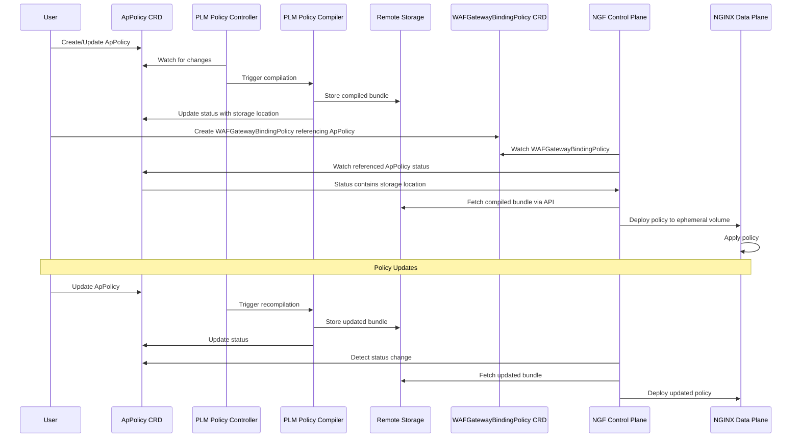

# Enhancement Proposal-3341: NGINX App Protect WAF Integration with PLM

- Issue: https://github.com/nginx/nginx-gateway-fabric/issues/3341
- Status: Implementable

## Summary

This proposal describes the integration of F5 WAF for NGINX with Policy Lifecycle Management (PLM) into NGINX Gateway Fabric (NGF) to provide comprehensive WAF protection at Gateway and Route levels. The design uses Gateway API inherited policy attachment to provide flexible, hierarchical WAF protection by referencing PLM-managed ApPolicy resources that contain compiled policy bundles in remote storage locations accessible via API.

## Goals

- Extend NginxProxy resource to enable NAP WAF for GatewayClass/Gateway with multi-container orchestration
- Design WAFGatewayBindingPolicy custom resource using inherited policy attachment for hierarchical WAF configuration with ApPolicy references
- Define deployment workflows that integrate with PLM's policy compilation and storage architecture
- Provide secure policy distribution from PLM in-cluster storage to NGF data plane without shared filesystem requirements
- Deliver enterprise-grade WAF capabilities through Kubernetes-native APIs with intuitive policy inheritance
- Maintain alignment with NGF's existing security and operational patterns
- Support configurable security logging for WAF events and policy violations
- Support both HTTPRoute and GRPCRoute protection

## Non-Goals

- Managing PLM controller deployment and lifecycle (handled by PLM team)
- Compiling WAF policies (handled by PLM Policy Compiler)
- Providing inline policy definition (not supported by NAP v5 architecture)
- Supporting NGINX OSS (NAP v5 does not require NGINX Plus, but OSS support is out of scope at this time)
- Real-time policy editing interfaces
- Persistent storage management for policy files in NGF data plane

## Introduction

### NAP v5 and PLM Architectural Overview

NGINX App Protect WAF v5 with Policy Lifecycle Management imposes specific architectural requirements:

- **Multi-container deployment**: Requires separate `waf-enforcer` and `waf-config-mgr` containers alongside the main NGINX container
- **PLM Policy Management**: Policies are managed through Kubernetes CRDs (ApPolicy, ApConfigSet, etc.) and compiled by PLM Policy Compiler
- **Remote Storage Architecture**: PLM stores compiled policies in remote storage accessible via API rather than shared filesystems
- **Per-instance ConfigMgr**: Each NGINX/Enforcer pod includes a ConfigMgr sidecar for local policy management

### Design Philosophy

This proposal provides the best possible Kubernetes-native experience by integrating with PLM's Kubernetes CRD-based policy management while respecting NGF's distributed Gateway architecture. The design uses Gateway API's inherited policy attachment pattern to provide intuitive hierarchical security with the ability to override policies at more specific levels.

### PLM Integration Benefits

- **Kubernetes-native Policy Management**: Define policies using Kubernetes CRDs rather than external workflows
- **Automated Policy Compilation**: PLM handles policy compilation and storage automatically
- **Centralized Policy Lifecycle**: Single source of truth for policy definitions across the cluster
- **Simplified Operations**: Eliminates need for external policy compilation pipelines and storage infrastructure
- **Automatic Policy Updates**: Changes to ApPolicy resources automatically trigger recompilation and deployment
- **In-Cluster Storage**: All policy storage managed within the cluster, no external dependencies required

### Policy Attachment Strategy

The design uses **inherited policy attachment** following Gateway API best practices:

- **Multiple targets per policy of the same type**: A WAFGatewayBindingPolicy can target muliple resources, but the resources must be of the same type (either a Gateway or Route types, not both)
- **Gateway-level policies** provide default protection for all routes attached to the Gateway
- **Route-level policies** can override Gateway-level policies for specific routes requiring different protection
- **Policy precedence**: More specific policies (Route-level) override less specific policies (Gateway-level)
- **Automatic inheritance**: New routes automatically receive Gateway-level protection without explicit configuration

### Storage Architecture

#### PLM Storage Model

PLM uses in-cluster storage with API access for policy distribution:

- **Policy Compiler Output**: Compiled policy bundles stored in in-cluster storage (Kubernetes-native storage solution managed by PLM)
- **API-based Access**: NGF retrieves policies via API calls to in-cluster storage service
- **No Shared Volumes Required**: Eliminates shared filesystem dependency for distributed deployments
- **Cluster-local Communication**: All policy distribution occurs within cluster boundaries

#### NGF Data Plane Storage

NGF maintains ephemeral volumes (emptyDir) for NAP v5's required local storage:

- **Security alignment**: No persistent state that could be compromised
- **Operational simplicity**: No persistent volume lifecycle management
- **Clean failure recovery**: Fresh volumes on pod restart with current policies
- **Immutable infrastructure**: Policy files cannot be modified at runtime

### Overall System Architecture

```mermaid
graph TB
    %% Kubernetes Cluster - PLM Components
    subgraph "Kubernetes Cluster - PLM Components"
        PolicyController[PLM Policy Controller<br/>Watches ApPolicy & ApLogConf CRDs]
        PolicyCompiler[PLM Policy Compiler<br/>Job-based Compilation]
        ClusterStorage[In-Cluster Policy Storage<br/>Kubernetes-native Storage Service]
    end

    %% Kubernetes Cluster - NGF Components
    subgraph "Kubernetes Cluster - NGF Components"

        %% Control Plane
        subgraph "nginx-gateway namespace"
            NGFPod[NGF Pod<br/>Controllers + Policy Fetcher]
        end

        %% Application Namespace
        subgraph "applications namespace"

            %% Gateway Resources
            Gateway[Gateway<br/>*.example.com]
            HTTPRoute[HTTPRoute<br/>Protected Route]
            GRPCRoute[GRPCRoute<br/>Protected gRPC Service]
            Application[Application<br/>Backend Service]

            %% Custom Resources (all in app namespace)
            NginxProxy[NginxProxy<br/>waf.enabled=true]
            GatewayWAFGatewayBindingPolicy[WAFGatewayBindingPolicy<br/>Gateway-level Protection<br/>References ApPolicy & ApLogConf]
            RouteWAFGatewayBindingPolicy[WAFGatewayBindingPolicy<br/>Route-level Override<br/>References ApPolicy & ApLogConf]

            %% PLM Resources
            ApPolicy[ApPolicy CRD<br/>Policy Definition]
            ApLogConf[ApLogConf CRD<br/>Logging Configuration]

            %% NGINX Data Plane (WAF Enabled)
            subgraph "NGINX Pod (Multi-Container when WAF enabled)"
                direction TB
                NGINXContainer[NGINX Container<br/>+ NAP Module]
                WafEnforcer[WAF Enforcer<br/>Container]
                WafConfigMgr[WAF Config Manager<br/>Sidecar per Pod]

                subgraph "Shared Volumes (Ephemeral)"
                    PolicyVol[Policy Volume<br/>emptyDir]
                    ConfigVol[Config Volume<br/>emptyDir]
                end
            end
        end
    end

    %% External Access
    PublicEndpoint[Public Endpoint<br/>Load Balancer]
    Client[Client Traffic]

    %% PLM Policy Workflow
    ApPolicy -->|Watched by| PolicyController
    ApLogConf -->|Watched by| PolicyController
    PolicyController -->|Triggers| PolicyCompiler
    PolicyCompiler -->|Stores Bundles| ClusterStorage
    PolicyController -->|Updates Status with<br/>Storage Location| ApPolicy
    PolicyController -->|Updates Status with<br/>Storage Location| ApLogConf

    %% Policy Attachment Flow
    GatewayWAFGatewayBindingPolicy -.->|References| ApPolicy
    GatewayWAFGatewayBindingPolicy -.->|References| ApLogConf
    RouteWAFGatewayBindingPolicy -.->|References| ApPolicy
    RouteWAFGatewayBindingPolicy -.->|References| ApLogConf
    GatewayWAFGatewayBindingPolicy -.->|Targets & Protects| Gateway
    RouteWAFGatewayBindingPolicy -.->|Targets & Overrides| HTTPRoute
    Gateway -->|Inherits Protection| HTTPRoute
    Gateway -->|Inherits Protection| GRPCRoute

    %% Configuration Flow
    NginxProxy -.->|Enables WAF| Gateway

    %% Control Plane Operations
    NGFPod -->|Watches Resources| NginxProxy
    NGFPod -->|Watches Resources| GatewayWAFGatewayBindingPolicy
    NGFPod -->|Watches Resources| RouteWAFGatewayBindingPolicy
    NGFPod -->|Watches ApPolicy Status| ApPolicy
    NGFPod -->|Watches ApLogConf Status| ApLogConf
    NGFPod -->|Fetches Policy via In-Cluster API<br/>HTTP or HTTPS| ClusterStorage
    NGFPod ===|gRPC Config| NGINXContainer
    NGFPod -->|Deploy Policy & Log Profiles| PolicyVol

    %% NAP v5 Inter-Container Communication
    NGINXContainer <-->|Shared FS| PolicyVol
    WafEnforcer <-->|Shared FS| PolicyVol
    WafConfigMgr <-->|Shared FS| PolicyVol
    WafConfigMgr <-->|Shared FS| ConfigVol
    NGINXContainer <-->|Shared FS| ConfigVol

    %% Traffic Flow
    Client ==>|HTTP/HTTPS/gRPC| PublicEndpoint
    PublicEndpoint ==>|WAF Protected| NGINXContainer
    NGINXContainer ==>|Filtered Traffic| Application

    %% Resource Relationships
    HTTPRoute -->|Attached to| Gateway
    GRPCRoute -->|Attached to| Gateway

    %% Styling
    classDef plm fill:#e3f2fd,stroke:#1565c0,stroke-width:2px
    classDef control fill:#f3e5f5,stroke:#4a148c,stroke-width:2px
    classDef gateway fill:#66CDAA,stroke:#333,stroke-width:2px
    classDef wafRequired fill:#ffebee,stroke:#c62828,stroke-width:3px
    classDef app fill:#fce4ec,stroke:#880e4f,stroke-width:2px
    classDef volume fill:#f1f8e9,stroke:#33691e,stroke-width:2px
    classDef endpoint fill:#FFD700,stroke:#333,stroke-width:2px
    classDef storage fill:#fff3e0,stroke:#e65100,stroke-width:2px
    classDef crd fill:#f0f4c3,stroke:#827717,stroke-width:2px

    class PolicyController,PolicyCompiler plm
    class NGFPod control
    class Gateway,HTTPRoute,GRPCRoute gateway
    class WafEnforcer,WafConfigMgr,PolicyVol,NginxProxy wafRequired
    class GatewayWAFGatewayBindingPolicy,RouteWAFGatewayBindingPolicy wafRequired
    class Application app
    class PolicyVol,ConfigVol volume
    class PublicEndpoint endpoint
    class ClusterStorage storage
    class ApPolicy,ApLogConf crd
```



This architecture demonstrates:

**PLM Components (Light Blue):** The PLM Policy Controller watches both ApPolicy and ApLogConf CRDs and triggers the Policy Compiler to generate policy and log profile bundles. Compiled bundles are stored in in-cluster storage accessible via API (HTTP or HTTPS).

**NGF Control Plane (Purple):** The NGF Pod watches WAFGatewayBindingPolicy resources that reference ApPolicy and ApLogConf CRDs. When status is updated with storage locations, NGF fetches the compiled bundles via in-cluster API (supporting both HTTP and HTTPS) and distributes them to the appropriate Gateway data plane pods.

**Policy and Logging Reference Flow:** WAFGatewayBindingPolicy resources use `apPolicySource` to reference ApPolicy CRDs and `securityLogs` to reference ApLogConf CRDs by name and namespace. NGF watches both resource types' status to get storage locations. This decouples NGF from direct PLM controller dependencies while leveraging PLM's compilation capabilities.

**In-Cluster Storage:** All policy and log profile storage and retrieval occurs within cluster boundaries. NGF accesses storage via Kubernetes-native API calls with configurable TLS support, eliminating external dependencies and simplifying network access requirements.

**Data Plane Storage:** Each Gateway pod maintains ephemeral volumes for local policy and log profile storage. NGF fetches both policies and log profiles from in-cluster storage and places them in these ephemeral volumes for NAP enforcement.

**Policy Inheritance:** Gateway-level WAFPolicies automatically protect all attached routes with both security policies and logging configurations. Route-level WAFPolicies can override Gateway policies with more specific protection and logging.

**Network Access:** All communication occurs within the cluster with optional TLS for secure storage communication - no external network access required for policy distribution.

### Policy Development Workflow with PLM

1. **Policy Development**: Define WAF policies using ApPolicy CRDs in Kubernetes
2. **Automatic Compilation**: PLM Policy Controller detects ApPolicy changes and triggers compilation
3. **Storage**: Compiled bundles stored in remote storage with location written to ApPolicy status
4. **Policy Attachment**: Create WAFGatewayBindingPolicy CR with `apPolicySource` referencing the ApPolicy
5. **Automatic Application**: NGF watches ApPolicy status, fetches bundle, and deploys to data plane
6. **Automatic Updates**: ApPolicy changes trigger recompilation, status update, and NGF re-fetch



### Security Logging Configuration

The securityLogs section supports multiple logging configurations by referencing PLM-managed ApLogConf CRDs. Each ApLogConf is compiled by PLM and stored in in-cluster storage, similar to ApPolicy resources.

**Logging Configuration Approach:**

- **ApLogConf References**: WAFGatewayBindingPolicy references ApLogConf CRDs by name and namespace
- **Compiled Log Profiles**: PLM Policy Controller watches ApLogConf, triggers compilation, and stores bundles
- **Multiple Configurations**: Support for multiple log configurations per WAFGatewayBindingPolicy
- **Cross-namespace**: ApLogConf can be referenced across namespaces with ReferenceGrant

**Destination Types:**

- `type: "Stderr"`: Output to container stderr
- `type: "File"`: Write to specified file path (must be mounted for waf-enforcer access)
- `type: "Syslog"`: Send to syslog server via TCP

**Generated NGINX Configuration:**

Each ApLogConf reference generates an `app_protect_security_log` directive in NGINX configuration:

```nginx
# ApLogConf compiled log profile to stderr
app_protect_security_log /shared_volume/custom-log-profile.tgz stderr;

# ApLogConf compiled log profile to file
app_protect_security_log /shared_volume/admin-log-profile.tgz /var/log/app_protect/security.log;

# ApLogConf compiled log profile to syslog
app_protect_security_log /shared_volume/blocked-log-profile.tgz syslog:server=syslog-svc.default:514;
```

### Policy Fetch Failure Handling

**First-Time Policy Fetch Failure:**

- Route configuration is **not applied** - no WAF protection enabled
- Route remains unprotected until policy becomes available
- WAFGatewayBindingPolicy status reflects the failure reason

**Policy Update Failure:**

- **Existing policy remains in effect** - no disruption to current protection
- WAF protection continues with the last successfully deployed policy
- WAFGatewayBindingPolicy status indicates update failure but maintains "Accepted" for existing policy

**Retry Behavior:**

- Configurable retry policy with exponential backoff
- No service disruption during retry attempts
- Detailed error messages in WAFGatewayBindingPolicy status for troubleshooting

### Policy Inheritance and Precedence

**Inheritance Hierarchy:**

- Gateway-level WAFGatewayBindingPolicy → HTTPRoute (inherited)
- Gateway-level WAFGatewayBindingPolicy → GRPCRoute (inherited)

**Override Precedence (most specific wins):**

- Route-level WAFGatewayBindingPolicy > Gateway-level WAFGatewayBindingPolicy

**Conflict Resolution:**

- Multiple policies targeting the same resource at the same level = error/rejected
- More specific policy completely overrides less specific policy
- Clear status reporting indicates which policy is active for each route

## API, Customer Driven Interfaces, and User Experience

### NGF Control Plane Configuration for PLM Storage

NGF control plane requires configuration to communicate with the PLM storage service (S3-compatible). This includes the storage endpoint URL, authentication credentials, and optional TLS settings.

> **Note:** PLM is still under active development. The exact authentication and TLS requirements may evolve as PLM matures. This section will be updated as the PLM storage API is finalized.

#### Configuration Approach

NGF uses Kubernetes Secrets for all sensitive PLM storage configuration:

- **Credentials Secret**: Contains S3 access credentials (`accessKeyId` and `secretAccessKey`)
- **TLS Secret** (optional): Contains TLS certificates for secure communication

Secret names are passed via CLI flags, and NGF reads the Secret contents at startup. This approach:

- Follows Kubernetes best practices for credential management
- Aligns with how NGF handles other secrets (NGINX Plus license, usage reporting)
- Avoids embedding credentials in deployment manifests
- Supports credential rotation via Secret updates (requires pod restart)

#### CLI Arguments

```bash
# PLM storage service URL (required when WAF enabled)
--plm-storage-url=https://plm-storage-service.plm-system.svc.cluster.local

# Secret containing S3 credentials (accessKeyId and secretAccessKey fields)
--plm-storage-credentials-secret=plm-storage-credentials

# TLS configuration (optional)
--plm-storage-tls-secret=plm-storage-tls        # Secret with ca.crt, tls.crt, tls.key
--plm-storage-tls-insecure-skip-verify=false    # Skip TLS verification (dev only)
```

#### Secrets Format

**Credentials Secret:**

```yaml
apiVersion: v1
kind: Secret
metadata:
  name: plm-storage-credentials
  namespace: nginx-gateway
type: Opaque
data:
  accessKeyId: <base64-encoded-access-key>
  secretAccessKey: <base64-encoded-secret-key>
```

**TLS Secret (optional):**

```yaml
apiVersion: v1
kind: Secret
metadata:
  name: plm-storage-tls
  namespace: nginx-gateway
type: Opaque
data:
  ca.crt: <base64-encoded-ca-certificate>       # CA certificate for server verification
  tls.crt: <base64-encoded-client-certificate>  # Client certificate for mutual TLS (optional)
  tls.key: <base64-encoded-client-key>          # Client key for mutual TLS (optional)
```

#### Helm Chart Configuration

```yaml
# values.yaml
nginxGateway:
  plmStorage:
    # Storage service URL (required when WAF enabled)
    url: "https://plm-storage-service.plm-system.svc.cluster.local"

    # Secret containing S3 credentials
    # Secret must have "accessKeyId" and "secretAccessKey" fields
    credentialsSecretName: "plm-storage-credentials"

    # TLS configuration
    tls:
      # Secret containing TLS certificates (ca.crt, optional tls.crt/tls.key)
      secretName: "plm-storage-tls"

      # Skip TLS certificate verification (development only)
      insecureSkipVerify: false
```

#### Configuration Options

| CLI Argument                             | Description                                                    | Default | Required         |
|------------------------------------------|----------------------------------------------------------------|---------|------------------|
| `--plm-storage-url`                      | PLM storage service URL (HTTP or HTTPS)                        | -       | When WAF enabled |
| `--plm-storage-credentials-secret`       | Name of Secret containing S3 credentials                       | -       | No*              |
| `--plm-storage-tls-secret`               | Name of Secret containing TLS certificates                     | -       | No               |
| `--plm-storage-tls-insecure-skip-verify` | Skip TLS certificate verification                              | false   | No               |

\* Credentials may be required depending on PLM storage RBAC configuration.

#### Security Recommendations

- **Development**: Use HTTP without TLS for simplicity, or HTTPS with `--plm-storage-tls-insecure-skip-verify=true`
- **Production**: Always use HTTPS with proper TLS verification via `--plm-storage-tls-secret`
- **High Security**: Enable mutual TLS by including `tls.crt` and `tls.key` in the TLS Secret
- **Never use** `--plm-storage-tls-insecure-skip-verify=true` in production

#### Design Decision: Reading Secrets via API vs Volume Mounts

Two approaches were considered for accessing PLM storage credentials and TLS certificates:

1. **Reading Secrets via Kubernetes API** (watching Secrets):
   - More responsive to changes (immediate)
   - Requires additional controller logic to watch Secrets and recreate S3 client
   - Adds complexity and potential failure modes

2. **Reading Secrets via API at startup** (current approach):
   - Simpler implementation - read Secret contents once at startup
   - Consistent with how NGF handles other secrets (Plus license, usage reporting)
   - Credential rotation requires pod restart
   - No additional controller complexity

The current design uses approach #2 (reading at startup) because:
- PLM storage credentials are unlikely to rotate frequently
- Simplicity and consistency with existing patterns outweigh the benefit of dynamic reloading
- A pod restart is a reasonable expectation for credential rotation

Dynamic credential reloading can be added in the future if there's a demonstrated need.

#### Open Questions (PLM Integration)

The following details depend on PLM's final implementation:

1. **Authentication mechanism**: Will PLM use static S3 credentials, or support other authentication methods (e.g., IAM roles, service account tokens)?
2. **Credential provisioning**: How will credentials be provisioned to NGF? Will PLM create the Secret, or will operators need to create it manually?
3. **TLS requirements**: Will TLS be required in production? What certificate chain will PLM storage use?
4. **Credential rotation**: Will PLM support credential rotation, and if so, how will NGF be notified?

These questions will be resolved as PLM development progresses

### NginxProxy Resource Extension

Users enable WAF through the NginxProxy resource:

```yaml
apiVersion: gateway.nginx.org/v1alpha2
kind: NginxProxy
metadata:
  name: nginx-proxy-waf
  namespace: nginx-gateway
spec:
  waf: "enabled"  # "enabled" | "disabled"
```

### WAFGatewayBindingPolicy Custom Resource with PLM Integration

```yaml
apiVersion: gateway.nginx.org/v1alpha1
kind: WAFGatewayBindingPolicy
metadata:
  name: gateway-protection-policy
  namespace: applications
spec:
  # Policy attachment - targets Gateway for inherited protection
  targetRefs:
  - group: gateway.networking.k8s.io
    kind: Gateway
    name: secure-gateway
    namespace: applications

  # PLM-managed policy source
  apPolicySource:
    name: "production-web-policy"
    namespace: "security"
    # Cross-namespace references require ReferenceGrant

  # Security logging configuration - references ApLogConf CRDs
  securityLogs:
  - name: "blocked-requests-logging"
    # Reference to ApLogConf CRD for logging configuration
    apLogConfSource:
      name: "log-blocked-profile"
      namespace: "security"
    destination:
      type: "Stderr"

  - name: "admin-detailed-logging"
    # Another ApLogConf reference for different logging profile
    apLogConfSource:
      name: "log-all-detailed-profile"
      namespace: "security"
    destination:
      type: "File"
      file:
        path: "/var/log/app_protect/detailed-security.log"

---
# Route-level override example
apiVersion: gateway.nginx.org/v1alpha1
kind: WAFGatewayBindingPolicy
metadata:
  name: admin-strict-policy
  namespace: applications
spec:
  # Policy attachment - targets specific HTTPRoute to override Gateway policy
  targetRefs:
  - group: gateway.networking.k8s.io
    kind: HTTPRoute
    name: admin-route
    namespace: applications

  # Reference stricter PLM-managed policy for admin routes
  apPolicySource:
    name: "admin-strict-web-policy"
    namespace: "security"

  securityLogs:
  - name: "admin-all-logging"
    apLogConfSource:
      name: "log-all-verbose-profile"
      namespace: "security"
    destination:
      type: "Stderr"
```

### ApPolicy CRD Example (Managed by PLM)

```yaml
# This resource is created and managed by users/security teams
# PLM controllers handle compilation and status updates
apiVersion: waf.f5.com/v1alpha1
kind: ApPolicy
metadata:
  name: production-web-policy
  namespace: security
spec:
  policy:
    name: "prod-web-protection"
    template:
      name: "POLICY_TEMPLATE_NGINX_BASE"
    applicationLanguage: "utf-8"
    enforcementMode: "blocking"
    # Additional NAP policy configuration
    signatures:
    - signatureSetRef:
        name: "high-accuracy-signatures"
    blocking-settings:
      violations:
      - name: "VIOL_SQL_INJECTION"
        alarm: true
        block: true

status:
  # PLM updates this after compilation
  state: "Compiled"
  # In-cluster storage location - accessible via Kubernetes-native API
  bundleLocation: "http://plm-storage-service.plm-system.svc.cluster.local/policies/prod-web-policy-v1.2.3.tgz"
  bundleChecksum: "sha256:abc123..."
  lastCompiled: "2025-08-15T10:30:00Z"
  conditions:
  - type: Compiled
    status: "True"
    reason: CompilationSucceeded
    message: "Policy successfully compiled and stored"
```

### ApLogConf CRD Example (Managed by PLM)

```yaml
# This resource is created and managed by users/security teams
# PLM controllers handle compilation and status updates
apiVersion: waf.f5.com/v1alpha1
kind: ApLogConf
metadata:
  name: log-blocked-profile
  namespace: security
spec:
  content:
    format: splunk
    max_message_size: "10k"
    max_request_size: "any"
  filter:
    request_type: "blocked"

status:
  # PLM updates this after compilation
  state: "Compiled"
  # In-cluster storage location for compiled log profile bundle
  bundleLocation: "http://plm-storage-service.plm-system.svc.cluster.local/log-profiles/log-blocked-profile-v1.0.0.tgz"
  bundleChecksum: "sha256:def456..."
  lastCompiled: "2025-08-15T10:32:00Z"
  conditions:
  - type: Compiled
    status: "True"
    reason: CompilationSucceeded
    message: "Log profile successfully compiled and stored"

---
# Another logging profile example - detailed logging
apiVersion: waf.f5.com/v1alpha1
kind: ApLogConf
metadata:
  name: log-all-detailed-profile
  namespace: security
spec:
  content:
    format: default
    max_message_size: "64k"
    max_request_size: "any"
  filter:
    request_type: "all"

status:
  state: "Compiled"
  bundleLocation: "http://plm-storage-service.plm-system.svc.cluster.local/log-profiles/log-all-detailed-v1.0.0.tgz"
  bundleChecksum: "sha256:ghi789..."
  lastCompiled: "2025-08-15T10:33:00Z"
  conditions:
  - type: Compiled
    status: "True"
    reason: CompilationSucceeded
    message: "Log profile successfully compiled and stored"
```

### Gateway and Route Resources

#### Gateway Configuration

```yaml
apiVersion: gateway.networking.k8s.io/v1
kind: Gateway
metadata:
  name: secure-gateway
  namespace: applications
spec:
  gatewayClassName: nginx
  infrastructure:
    parametersRef:
      name: nginx-proxy-waf
      group: gateway.nginx.org
      kind: NginxProxy
  listeners:
  - name: http
    port: 80
    protocol: HTTP
  - name: grpc
    port: 9090
    protocol: HTTP
    hostname: "grpc.example.com"
```

#### HTTPRoute Integration

```yaml
apiVersion: gateway.networking.k8s.io/v1
kind: HTTPRoute
metadata:
  name: protected-application
  namespace: applications
spec:
  parentRefs:
  - name: secure-gateway
  rules:
  - matches:
    - path:
        type: PathPrefix
        value: "/api"
    backendRefs:
    - name: api-service
      port: 8080
  # Inherits gateway-protection-policy WAFGatewayBindingPolicy automatically

---
apiVersion: gateway.networking.k8s.io/v1
kind: HTTPRoute
metadata:
  name: admin-route
  namespace: applications
spec:
  parentRefs:
  - name: secure-gateway
  rules:
  - matches:
    - path:
        type: PathPrefix
        value: "/admin"
    backendRefs:
    - name: admin-service
      port: 8080
  # Uses admin-strict-policy WAFGatewayBindingPolicy override via targetRefs
```

#### GRPCRoute Integration

```yaml
apiVersion: gateway.networking.k8s.io/v1alpha2
kind: GRPCRoute
metadata:
  name: protected-grpc-service
  namespace: applications
spec:
  parentRefs:
  - name: secure-gateway
  hostnames:
  - "grpc.example.com"
  rules:
  - matches:
    - method:
        service: "user.UserService"
    backendRefs:
    - name: grpc-service
      port: 9000
  # Inherits gateway-protection-policy WAFGatewayBindingPolicy automatically
```

### Cross-Namespace Policy References

```yaml
# ReferenceGrant to allow WAFGatewayBindingPolicy in applications namespace
# to reference ApPolicy in security namespace
apiVersion: gateway.networking.k8s.io/v1beta1
kind: ReferenceGrant
metadata:
  name: allow-WAFGatewayBindingPolicy-appolicy-ref
  namespace: security
spec:
  from:
  - group: gateway.nginx.org
    kind: WAFGatewayBindingPolicy
    namespace: applications
  to:
  - group: waf.f5.com
    kind: ApPolicy
  - group: waf.f5.com
    kind: ApLogConf
```

## WAFGatewayBindingPolicy Status Conditions

### CRD Label

The `WAFGatewayBindingPolicy` CRD includes the `gateway.networking.k8s.io/policy: inherited` label to specify it as an inherited policy.

### Status Conditions

The `WAFGatewayBindingPolicy` includes status conditions following Gateway API policy patterns. Each condition has a Type and Reason:

#### Accepted Condition

The `Accepted` condition indicates whether the policy is valid and can be applied.

| **Reason**           | **Status** | **Description**                                                   | **Example Message**                                                    |
|----------------------|------------|-------------------------------------------------------------------|------------------------------------------------------------------------|
| `Accepted`           | True       | Policy is valid and accepted                                      | "The Policy is accepted"                                               |
| `Invalid`            | False      | Policy is syntactically or semantically invalid                   | "spec.apPolicySource.name is required"                                 |
| `TargetNotFound`     | False      | Target Gateway or Route does not exist                            | "Gateway 'secure-gateway' not found in namespace 'applications'"       |
| `Conflicted`         | False      | Another WAFGatewayBindingPolicy targets the same resource         | "WAFGatewayBindingPolicy 'other-policy' already targets this Gateway"  |

#### ResolvedRefs Condition

The `ResolvedRefs` condition indicates whether all referenced resources (ApPolicy, ApLogConf) are resolved and valid.

| **Reason**           | **Status** | **Description**                                                   | **Example Message**                                                    |
|----------------------|------------|-------------------------------------------------------------------|------------------------------------------------------------------------|
| `ResolvedRefs`       | True       | All ApPolicy and ApLogConf references are resolved                | "All references are resolved"                                          |
| `InvalidRef`         | False      | Referenced ApPolicy or ApLogConf does not exist or is not compiled| "ApPolicy 'prod-policy' not found in namespace 'security'"             |
| `RefNotPermitted`    | False      | Cross-namespace reference not allowed by ReferenceGrant           | "Cross-namespace ApPolicy reference requires ReferenceGrant"           |

#### Programmed Condition (Optional)

The `Programmed` condition indicates whether the policy has been successfully deployed to the data plane.

| **Reason**           | **Status** | **Description**                                                   | **Example Message**                                                    |
|----------------------|------------|-------------------------------------------------------------------|------------------------------------------------------------------------|
| `Programmed`         | True       | Policy and log profiles deployed to data plane                    | "Policy successfully deployed to Gateway"                              |
| `FetchError`         | False      | Failed to fetch bundle from PLM storage                           | "Failed to fetch policy bundle: connection timeout"                    |
| `IntegrityError`     | False      | Checksum verification failed                                      | "Policy integrity check failed: checksum mismatch"                     |
| `DeploymentError`    | False      | Data plane failed to apply policy                                 | "Failed to deploy WAF policy to NGINX Pods"                            |

### Example WAFGatewayBindingPolicy Status

```yaml
status:
  ancestors:
  - ancestorRef:
      group: gateway.networking.k8s.io
      kind: Gateway
      name: secure-gateway
      namespace: applications
    conditions:
    - type: Accepted
      status: "True"
      reason: Accepted
      message: "The Policy is accepted"
      lastTransitionTime: "2025-08-15T10:35:00Z"
    - type: ResolvedRefs
      status: "True"
      reason: ResolvedRefs
      message: "All references are resolved"
      lastTransitionTime: "2025-08-15T10:35:00Z"

  # Additional status information
  apPolicyStatus:
    name: "production-web-policy"
    namespace: "security"
    state: "Compiled"
    lastFetched: "2025-08-15T10:35:00Z"
    bundleLocation: "http://plm-storage-service.plm-system.svc.cluster.local/policies/prod-web-policy-v1.2.3.tgz"

  # Log profile status information
  apLogConfStatus:
  - name: "log-blocked-profile"
    namespace: "security"
    state: "Compiled"
    lastFetched: "2025-08-15T10:35:00Z"
    bundleLocation: "http://plm-storage-service.plm-system.svc.cluster.local/log-profiles/log-blocked-profile-v1.0.0.tgz"
  - name: "log-all-detailed-profile"
    namespace: "security"
    state: "Compiled"
    lastFetched: "2025-08-15T10:35:00Z"
    bundleLocation: "http://plm-storage-service.plm-system.svc.cluster.local/log-profiles/log-all-detailed-v1.0.0.tgz"
```

### Setting Status on Affected Objects

Following Gateway API policy patterns, NGF sets a condition on objects affected by WAFGatewayBindingPolicy:

```go
const (
    WAFGatewayBindingPolicyAffected gatewayv1alpha2.PolicyConditionType = "gateway.nginx.org/WAFGatewayBindingPolicyAffected"
    PolicyAffectedReason gatewayv1alpha2.PolicyConditionReason = "PolicyAffected"
)
```

Example condition on affected Gateway:

```yaml
conditions:
- type: gateway.nginx.org/WAFGatewayBindingPolicyAffected
  status: "True"
  reason: PolicyAffected
  message: "Gateway protected by WAFGatewayBindingPolicy 'gateway-protection-policy'"
  observedGeneration: 1
  lastTransitionTime: "2025-08-15T10:35:00Z"
```

## Implementation Details

### NGF Control Plane Changes

**ApPolicy and ApLogConf Watcher:**

- Watch ApPolicy resources referenced by WAFGatewayBindingPolicy
- Watch ApLogConf resources referenced by WAFGatewayBindingPolicy securityLogs
- Monitor status for compilation state and storage location
- Trigger policy/log profile fetch when status indicates successful compilation
- Handle multiple ApLogConf references per WAFGatewayBindingPolicy

**Policy Fetcher Enhancement:**

- Add support for fetching from PLM in-cluster storage API
- Implement HTTP/HTTPS client for in-cluster service communication
- Support configurable TLS with CA certificate validation
- Support mutual TLS with client certificates
- Handle API-specific error conditions and retries
- Verify bundle checksums against ApPolicy/ApLogConf status
- Fetch both policy and log profile bundles

**ReferenceGrant Validation:**

- Validate cross-namespace ApPolicy references
- Validate cross-namespace ApLogConf references
- Check for required ReferenceGrant resources
- Update WAFGatewayBindingPolicy status with permission errors if missing

**TLS Configuration Handling:**

- Load TLS configuration from CLI arguments at startup
- Load CA certificates from mounted Secret volumes
- Load client certificates from mounted Secret volumes for mutual TLS
- Configure HTTP client with TLS settings once at initialization
- Support insecure connections for development scenarios
- Validate TLS configuration at startup and log errors

### Data Plane Policy Deployment

**NGF Control Plane Managed**

NGF control plane handles all external communication and policy/log profile distribution:

1. **Watch ApPolicy and ApLogConf Status**: NGF watches referenced resources for status.bundleLocation updates
2. **Fetch Bundles**: NGF fetches compiled policy and log profile bundles from in-cluster storage via HTTP/HTTPS API
3. **Verify Integrity**: NGF validates bundle checksums against ApPolicy/ApLogConf status.bundleChecksum
4. **Distribute to Data Plane**: NGF writes both policy and log profile bundles to ephemeral volume via gRPC/Agent connection
5. **ConfigMgr Discovery**: ConfigMgr discovers policy and log profiles from local ephemeral volume

**Benefits:**
- Clear separation: control plane handles network, data plane handles local operations
- Centralized TLS configuration and error handling in control plane
- ConfigMgr remains simple with no external API dependencies
- Consistent with NGF's existing architecture patterns

**Implementation Notes:**
- NGF requires network access to PLM storage service (in-cluster service communication)
- ConfigMgr configuration points to local filesystem paths only
- Both policy and log profile bundles deployed to shared ephemeral volumes

### Policy Update Detection

**PLM-Managed Policies and Log Profiles (Automatic):**

- NGF watches ApPolicy status changes via Kubernetes watch mechanism
- NGF watches ApLogConf status changes via Kubernetes watch mechanism
- Automatic update when ApPolicy `status.bundleLocation` or `status.lastCompiled` changes
- Automatic update when ApLogConf `status.bundleLocation` or `status.lastCompiled` changes
- No polling required - event-driven updates via Kubernetes API
- Immediate propagation when PLM recompiles policies or log profiles

**Update Flow:**
1. User updates ApPolicy or ApLogConf spec
2. PLM Policy Controller triggers recompilation
3. PLM updates resource status with new bundle location and timestamp
4. NGF detects status change via watch
5. NGF fetches new bundle from in-cluster storage
6. NGF deploys updated policy/log profile to affected Gateway data planes

### Multi-Container Pod Orchestration

- NGINX container with NAP module
- WAF Enforcer sidecar
- WAF ConfigMgr sidecar per pod instance
- Ephemeral shared volumes for inter-container communication

## Security Considerations

### PLM Integration Security

**API Access Control:**

- NGF service account requires appropriate RBAC for ApPolicy and ApLogConf read access across namespaces
- In-cluster HTTP/HTTPS communication to PLM storage service
- Configurable TLS for secure communication (recommended for production)
- Cross-namespace references controlled via ReferenceGrant

**Policy Integrity:**

- Checksum validation of fetched policy and log profile bundles against ApPolicy/ApLogConf status
- TLS encryption for in-cluster communication when enabled
- Bundle signature verification via resource status metadata

**Network Security:**

- All policy distribution occurs within cluster boundaries
- No external network access required
- Configurable TLS with CA certificate validation
- Optional mutual TLS with client certificates
- Standard Kubernetes NetworkPolicy support for restricting in-cluster traffic
- PLM storage service accessible via Kubernetes service DNS
- Storage service credentials will be provided by PLM and stored in a Kubernetes Secret

**TLS Best Practices:**

- Production environments should enable TLS with CA certificate validation
- Use mutual TLS for enhanced security in sensitive environments
- Development/testing can use insecure HTTP for simplicity
- CA and client certificates mounted via Kubernetes Secrets to NGF pod
- Certificate rotation supported through Secret updates (requires pod restart)
- TLS configuration is cluster-wide (all WAFPolicies use same settings)

### Policy Reference Security

**Cross-Namespace Access:**

- ReferenceGrant required for cross-namespace ApPolicy references
- Explicit permission model prevents unauthorized policy use
- Clear error messages when references not permitted

**Policy Isolation:**

- Each Gateway deployment maintains independent policy state
- No shared policy storage between deployments
- Ephemeral volumes ensure clean state on pod restart

## Testing

### Unit Testing

- ApPolicy reference resolution and validation
- ApLogConf reference resolution and validation
- ReferenceGrant validation logic for both ApPolicy and ApLogConf
- ApPolicy and ApLogConf status watching and change detection
- In-cluster storage API client interactions (mocked)
- Bundle checksum verification for policies and log profiles
- TLS configuration parsing and validation
- Certificate loading from Secrets
- Multiple ApLogConf references per WAFGatewayBindingPolicy

### Integration Testing

- Complete PLM integration flow from ApPolicy/ApLogConf creation to enforcement
- Cross-namespace policy and log profile references with ReferenceGrant
- Policy inheritance with PLM-managed policies and log profiles
- Policy override scenarios at Route level
- Policy and log profile update propagation from ApPolicy/ApLogConf changes
- Failure scenarios (resources not found, not compiled, fetch errors)
- In-cluster storage service communication with HTTP
- In-cluster storage service communication with HTTPS and TLS verification
- Mutual TLS with client certificates
- Certificate rotation scenarios
- Multiple log profiles per WAFGatewayBindingPolicy

### Performance Testing

- Policy and log profile fetch performance from in-cluster storage API
- Impact of watching multiple ApPolicy and ApLogConf resources at scale
- Multi-Gateway deployments with shared ApPolicy and ApLogConf references
- Policy and log profile update propagation time across multiple Gateways
- TLS handshake overhead for storage communication

## Open Questions

1. **PLM Storage Service**:
   - What is the exact in-cluster storage service endpoint? (e.g., `plm-storage-service.plm-system.svc.cluster.local`)
   - Rate limiting considerations for bundle fetches
   - The API will be S3 conformant, so we can use the AWS SDK

2. **Authentication and Credentials**:
   - Will PLM use static S3 credentials, or support other authentication methods (e.g., IAM roles, service account tokens)?
   - How will credentials be provisioned to NGF? Will PLM create the Secret, or will operators need to create it manually?
   - Will PLM support credential rotation, and if so, how will NGF be notified?

3. **TLS Configuration**:
   - Will TLS be required in production?
   - What certificate chain will PLM storage use?
   - Support for custom CA certificates
   - Mutual TLS requirements for enhanced security

4. **Policy Reload Mechanism**: Does NGINX require reload when policies or log profiles change?
   - No: can use NAP reload functionality (mechanism TBC)

5. **Configuration Location (CLI flags vs NginxGateway CRD)**:
   - PLM storage configuration is currently proposed as CLI flags/Helm values (set at install time)
   - An alternative would be to configure PLM storage in the NginxGateway CRD, which would:
     - Allow dynamic configuration changes without pod restart
     - Consolidate control plane configuration in one Kubernetes-native resource
     - Expand the NginxGateway CRD beyond just dynamic logging configuration
   - Trade-offs to consider:
     - PLM storage config is infrastructure-level and unlikely to change frequently
     - Moving to CRD adds controller complexity for watching configuration changes
     - Consistency concern: if some control plane config is in CRD and some in CLI flags, this may be confusing
   - Decision deferred until PLM requirements are clearer and there's a broader vision for what NginxGateway CRD should contain

## References

- [NGINX App Protect WAF v5 Documentation](https://docs.nginx.com/nginx-app-protect-waf/v5/)
- [Gateway API Policy Attachment](https://gateway-api.sigs.k8s.io/reference/policy-attachment/)
- [PLM Architecture Documentation](https://internal-docs.f5.com/nap-plm) (Internal)
- NAP v5 for Kubernetes Architecture Diagrams (attached images)

## Appendix: Complete Configuration Example

```yaml
# 1. PLM Storage Credentials Secret
apiVersion: v1
kind: Secret
metadata:
  name: plm-storage-credentials
  namespace: nginx-gateway
type: Opaque
data:
  accessKeyId: <base64-encoded-access-key>
  secretAccessKey: <base64-encoded-secret-key>

---
# 2. PLM Storage TLS Secret (optional, for HTTPS with custom CA or mutual TLS)
apiVersion: v1
kind: Secret
metadata:
  name: plm-storage-tls
  namespace: nginx-gateway
type: Opaque
data:
  ca.crt: <base64-encoded-ca-certificate>
  # Optional: for mutual TLS
  # tls.crt: <base64-encoded-client-certificate>
  # tls.key: <base64-encoded-client-key>

---
# 3. NGF Deployment with PLM storage configuration
# Note: When using Helm, these args are configured via values.yaml
apiVersion: apps/v1
kind: Deployment
metadata:
  name: nginx-gateway
  namespace: nginx-gateway
spec:
  template:
    spec:
      containers:
      - name: nginx-gateway
        image: ghcr.io/nginxinc/nginx-gateway-fabric:edge
        args:
        - --gateway-ctlr-name=gateway.nginx.org/nginx-gateway-controller
        - --gatewayclass=nginx
        # PLM storage configuration
        - --plm-storage-url=https://plm-storage-service.plm-system.svc.cluster.local
        - --plm-storage-credentials-secret=plm-storage-credentials
        - --plm-storage-tls-secret=plm-storage-tls

---
# 4. Enable WAF on NginxProxy
apiVersion: gateway.nginx.org/v1alpha2
kind: NginxProxy
metadata:
  name: waf-enabled-proxy
  namespace: nginx-gateway
spec:
  waf: "enabled"

---
# 3. Define WAF policy using PLM ApPolicy CRD
apiVersion: waf.f5.com/v1alpha1
kind: ApPolicy
metadata:
  name: production-web-policy
  namespace: security
spec:
  policy:
    name: "prod-web-protection"
    template:
      name: "POLICY_TEMPLATE_NGINX_BASE"
    enforcementMode: "blocking"
    signatures:
    - signatureSetRef:
        name: "high-accuracy-signatures"
# Status updated by PLM after compilation
status:
  state: "Compiled"
  bundleLocation: "https://plm-storage-service.plm-system.svc.cluster.local/policies/prod-policy.tgz"
  bundleChecksum: "sha256:abc123..."

---
# 4. Define logging profiles using PLM ApLogConf CRDs
apiVersion: waf.f5.com/v1alpha1
kind: ApLogConf
metadata:
  name: log-blocked-profile
  namespace: security
spec:
  content:
    format: splunk
    max_message_size: "10k"
  filter:
    request_type: "blocked"
status:
  state: "Compiled"
  bundleLocation: "https://plm-storage-service.plm-system.svc.cluster.local/log-profiles/log-blocked-v1.0.0.tgz"
  bundleChecksum: "sha256:def456..."

---
apiVersion: waf.f5.com/v1alpha1
kind: ApLogConf
metadata:
  name: log-all-detailed-profile
  namespace: security
spec:
  content:
    format: default
    max_message_size: "64k"
  filter:
    request_type: "all"
status:
  state: "Compiled"
  bundleLocation: "https://plm-storage-service.plm-system.svc.cluster.local/log-profiles/log-all-detailed-v1.0.0.tgz"
  bundleChecksum: "sha256:ghi789..."

---
# 5. Create Gateway with WAF enabled
apiVersion: gateway.networking.k8s.io/v1
kind: Gateway
metadata:
  name: secure-gateway
  namespace: applications
spec:
  gatewayClassName: nginx
  infrastructure:
    parametersRef:
      name: waf-enabled-proxy
      group: gateway.nginx.org
      kind: NginxProxy
  listeners:
  - name: http
    port: 80
    protocol: HTTP
  - name: grpc
    port: 9090
    protocol: HTTP
    hostname: "grpc.example.com"

---
# 6. Allow cross-namespace ApPolicy and ApLogConf references
apiVersion: gateway.networking.k8s.io/v1beta1
kind: ReferenceGrant
metadata:
  name: allow-WAFGatewayBindingPolicy-references
  namespace: security
spec:
  from:
  - group: gateway.nginx.org
    kind: WAFGatewayBindingPolicy
    namespace: applications
  to:
  - group: waf.f5.com
    kind: ApPolicy
  - group: waf.f5.com
    kind: ApLogConf

---
# 7. Gateway-level WAFGatewayBindingPolicy referencing ApPolicy and ApLogConf
apiVersion: gateway.nginx.org/v1alpha1
kind: WAFGatewayBindingPolicy
metadata:
  name: gateway-base-protection
  namespace: applications
spec:
  targetRefs:
  - group: gateway.networking.k8s.io
    kind: Gateway
    name: secure-gateway
    namespace: applications

  apPolicySource:
    name: "production-web-policy"
    namespace: "security"

  securityLogs:
  - name: "blocked-requests"
    apLogConfSource:
      name: "log-blocked-profile"
      namespace: "security"
    destination:
      type: "Stderr"
  - name: "detailed-logging"
    apLogConfSource:
      name: "log-all-detailed-profile"
      namespace: "security"
    destination:
      type: "File"
      file:
        path: "/var/log/app_protect/detailed-security.log"

---
# 8. HTTPRoute inheriting Gateway protection
apiVersion: gateway.networking.k8s.io/v1
kind: HTTPRoute
metadata:
  name: api-route
  namespace: applications
spec:
  parentRefs:
  - name: secure-gateway
  rules:
  - matches:
    - path:
        type: PathPrefix
        value: "/api"
    backendRefs:
    - name: api-service
      port: 8080

---
# 9. GRPCRoute inheriting Gateway protection
apiVersion: gateway.networking.k8s.io/v1alpha2
kind: GRPCRoute
metadata:
  name: user-grpc-service
  namespace: applications
spec:
  parentRefs:
  - name: secure-gateway
  hostnames:
  - "grpc.example.com"
  rules:
  - matches:
    - method:
        service: "user.UserService"
    backendRefs:
    - name: user-grpc-service
      port: 9000
```

This complete example demonstrates:

- PLM-based policy definition using ApPolicy CRD
- PLM-based logging configuration using ApLogConf CRDs
- Cross-namespace policy and log profile references with ReferenceGrant
- Gateway-level inherited protection with multiple log profiles
- Automatic policy and log profile updates when PLM recompiles
- HTTP and gRPC route protection with seamless policy inheritance
- Kubernetes-native policy and logging lifecycle management
